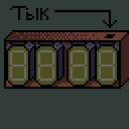
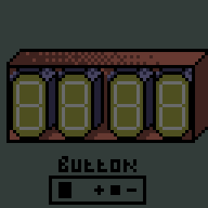
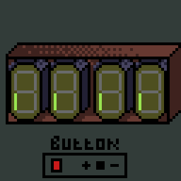
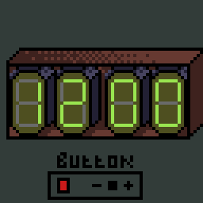
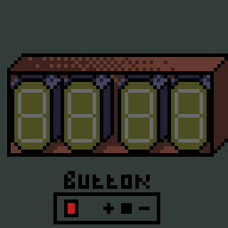

# Часы. Просто часы.

Не помню как эта штука называется:
1) Описание
2) Схема
3) Кодъ
4) Первое включение
5) Настройка анимаций
6) Настройка времени
7) Благодарности

## 1. Описание

Захотелось значит-с сделать красивые часики на вакумно люминисцентных индикаторах?Ок.

### Программно поддерживаются:
* любые 7-ми сегментные VFD индикаторы.

### Аппаратно поддерживаются:
* Ив-12
* Ив-22 // сделать таблицу поддерживаемых индикаторов

## 2. Схема

__*туть будет схема*__ А это мои страдания! @Wacko

## 3. Кодъ

__*туть будет пару слов о коде*__ Илья, я в тебя верю!

## 4. Первое включение

При подачи питания происходит перебор всех сегментов и разрядов. Выглядеть должно следующим образом:

Если все точно так же - часы работают!

О настройке анимаций в следующем разделе.

## 5. Настройка анимаций
Есть 2 типа анимации:
* Перебор сегментов
* Бегущая строка

Каждый режим анимации можно отключить. 
___
## Перебор сегментов:

Эта анимация проигрывается только при запуске часов и проверяет работоспособность сегментов и сетки каждой лампы.

### Отключение анимации перебора:

    1) Выключить часы
    2) Зажать кнопку "-"
    3) Включить часы
    4) Отпустить кнопку

    На экране высветилось A1_0 - означает что Анимация 1 отключена

Теперь эта анимация больше не побеспокоит.

### Включение анимации перебора:
    Точно так же как и отключение.

    A1_1 - означает что Анимация 1 включена

___
## Бегущая строка:

